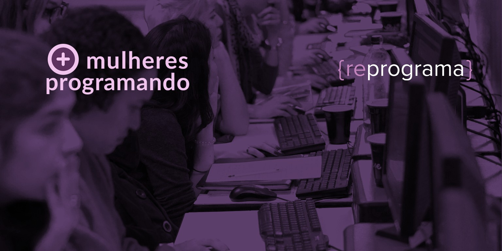

# Bootcamp {reprograma}
## *Bootcamp à distância em parceria com o projeto MINAS - Porto Digital de Recife*

# Conteúdos do curso

### 1. Lógica de Programação
A sequência lógica para construir um programa, os tipos de dados usados, repetições, decisões e variáveis são os componentes estudados pela lógica de programação.

### 2. JavaScript
Códigos escritos na linguagem Javascript para várias atividades: atualizar apenas parte de uma página para acelerar a navegação, validar dados de um formulário ou até permitir usar jogos dentro do próprio navegador.

### 3. API
API (Application Programming Interface) Interface de Programação de Aplicação, que serve para integrar dois aplicativos ou para embutir uma aplicação dentro de outra.

### 4. Node.JS
Node.js é uma plataforma construída sobre o motor JavaScript do Google Chrome para facilmente construir aplicações de rede rápidas e escaláveis.

### 5. Git & GitHub
Git é uma ferramenta de sistema de controle de versões que é usada principalmente no desenvolvimento de software.

### 6. Projetos práticos
Durante o curso, quatro projetos práticos são desenvolvidos. Os projetos tem por objetivo incentivar a montagem o portfólio profissional e simular de forma realista o mercado de trabalho.