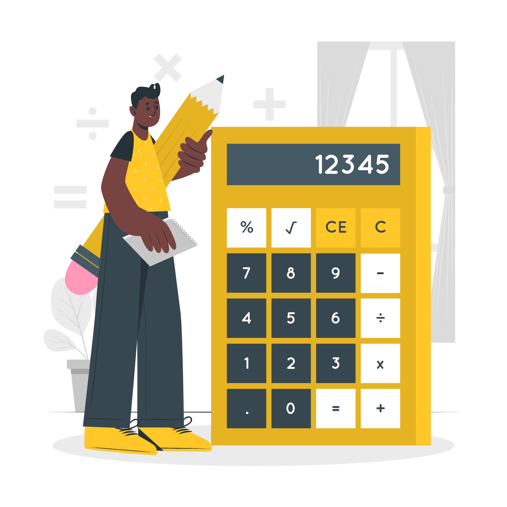

<h1 align="center">
  

Lógica - Desafio da Calculadora

## Desafio :pushpin:

O desafio da Semana 02 consiste em criar uma **calculadora de média** para dizer se uma estudante foi aprovada, reprovada ou precisaria fazer a recuperação, de acordo com a sua média escolar.

**Regras:**
* Para ser APROVADA, a estudante precisa ter uma média igual ou superior a 7,0;
* Se a média for entre 5,0 e 7,0, ela ainda pode ter uma chance de ser aprovada indo para a RECUPERAÇÃO;
* Mas se a média estiver abaixo de 5,0, infelizmente essa estudante estará REPROVADA.

**Conhecimentos aplicados**
* Node.js;
* Tipos em Javascript;
* Operadores;
* Estruturas Condicionais (if / else if / else / Switch Case);
* Escopo (global / local);
* Variáveis;
* Resolução de problemas / Algoritmos;
* parseInt / parseFloat / toFixed.

## Repositório da aula da semana:

[reprograma/on7-porto-s2-resolucao-problemas-I](https://github.com/reprograma/on7-porto-s2-resolucao-problemas-I)