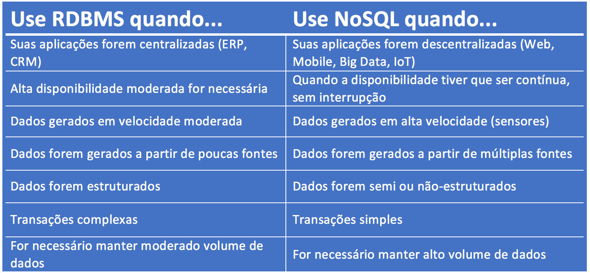

<h1 align="center">
  

Banco de Dados - Introdução

## O que é um banco de dados?

Basicamente são coleções de dados interligados, armazenados e organizados com o objetivo de fornecer informações.

É importante lembrar que dados e informações **não são a mesma coisa**, pois:

* **Dados** são fatos brutos, em sua forma primária e muitas vezes podem não fazer sentido sozinhos.

* **Informações** consistem no agrupamento de dados de forma organizada para fazer sentido, geram conhecimento.

Além disso, é importante saber que um banco de dados também é formado por **metadados**, dado relativo a outro dado, que auxiliam na organização e extração de informações.

## Entidades e Atributos

Uma **entidade** é um objeto que reúne um conjunto de informações sobre determinado conceito do sistema, que por sua vez pode ser abstrato, como um feriado por exemplo, ou concreto, como uma pessoa, um livro.

Já o **conjunto de entidades** é formado por objetos do mesmo tipo. O conjunto de todas as pessoas com conta em um banco, por exemplo, pode ser definido como o conjunto de todas as entidades cliente.

Toda entidade é representada por um conjunto de **atributos**, que são os dados que referenciam a entidade. Eles podem ser dos seguintes tipos:

* *Compostos* - Os atributos compostos podem ser divididos em partes menores, ou subpartes, os quais representariam atributos básicos mais simples com significados independentes. Por exemplo, um atributo endereço pode ser subdividido em rua, cidade, estado e cep. Poderíamos também dividir o atributo rua em número, nome-rua e número-apartamento. Atributos deste tipo formam uma hierarquia.

* *Simples* - São chamados também por atributos atômicos. Eles não são divisíveis.
Monovalorados. São atributos que possuem apenas um valor para uma entidade em particular. Por exemplo, a idade é um atributo monovalorado para uma entidade pessoa.

* *Multivalorado* - São atributos que possuem um ou mais valores para o mesmo. Por exemplo, o atributo idioma de uma entidade aluno pode conter os valores inglês e francês. Para um outro aluno poderia conter apenas um valor - espanhol. Para um terceiro aluno, poderíamos ter 3 valores para este atributo.

* *Armazenado* - Em geral todos os atributos são armazenados.

* *Derivado* - Alguns atributos podem ter uma relação entre si. Por exemplo, idade e data-nascimento de uma pessoa. Para uma pessoa em particular, podemos determinar o valor atual de idade através do atributo data-nascimento. Então idade é chamado um atributo derivado e é derivado do atributo data-nascimento. Alguns atributos podem ser derivados de entidades relacionadas. Por exemplo, um atributo número-empregados de uma entidade departamento pode ser derivado através da contagem de número de empregados que trabalham-para um departamento.

* *Nulo* - Em alguns casos, uma entidade pode não necessitar de um valor aplicável a um de seus atributos. Por exemplo, no atributo número-apartamento composto visto acima, apenas definiremos valores para este campo quando a entidade pessoa em particular morar em um prédio. Outro exemplo é multivalorado idioma de um aluno: caso este aluno em particular não tenha fluência em nenhuma língua, então não necessitamos preencher o valor deste atributo. A representação de um atributo sem valor é colocarmos um valor especial null. Null também pode ser utilizado quando não conhecemos o valor de um atributo, por exemplo, quando se é desconhecida a data de nascimento de uma pessoa.

## Sistemas de Gerenciamento de Bancos de Dados

Um **Sistema de Gerenciamento de Banco de Dados (SGBD)** – do inglês *Data Base Management System (DBMS)* – é o conjunto de programas de computador (softwares) responsáveis pelo gerenciamento de uma base de dados. Seu principal objetivo é retirar da aplicação cliente a responsabilidade de gerenciar o acesso, a manipulação e a organização dos dados. 

O SGBD é responsável por tudo, salvar os dados no HD, manter em memória os dados mais acessados, ligar dados e metadados, disponibilizar uma interface para programas e usuários externos acessem o banco de dados (para banco de dados relacionais, é utilizada a linguagem SQL), encriptar dados, controlar o acesso a informações, manter cópias dos dados para recuperação de uma possível falha, garantir transações no banco de dados.

## Quais os tipos de banco de dados?

Existem várias opções no mercado para banco de dados e a escolha depende sobre qual o modelo de organização de informações de cada organização. Entretanto, antes de saber qual o melhor se adequa à necessidade, é preciso entender que há dois tipos:

* **Bancos de dados RELACIONAIS** - Criados no paradigma da orientação a conjuntos. Dessa forma, os dados que ali estão disponíveis serão armazenados em tabelas. Cada tabela terá atributos e linhas ou registros responsáveis por organizar essas informações. A linguagem utilizada nesse formato é de **SQL**, *Structured Query Language*.

* **Bancos de dados NÃO RELACIONAIS** - São responsáveis por atender a demandas que os bancos relacionais não conseguem suprir. Um exemplo de demandas são aqueles dados mistos, onde se misturam tabelas, imagens e mapas, por exemplo, que não poderão ser tabulados em colunas e linhas de tabela. A linguagem utilizada nesse formato é **NoSQL**.

<h4 align="center">
<b>
Abaixo, tabela que mostra quando utilizar um banco de dados SQL ou NoSQL:
</b>
<h1 align="center">
    

## O que é MongoDB?

É um tipo de Bancos de Dados orientados a documentos e NoSQL. O **MongoDB** tem como característica ser código-fonte aberto, gratuito, de alta performance, não possui esquemas, escrito em C++, multiplataforma e ser formado por um conjunto de aplicativos JSON.

<h4 align="center">
    
</h1>

Dados desestruturados são um problema para a imensa maioria dos bancos de dados relacionais, mas não tanto para o MongoDB. Quando o seu schema é variável, é livre, usar MongoDB vem muito bem a calhar. Os documentos BSON (JSON binário) do Mongo são schemaless e aceitam quase qualquer coisa que você quiser armazenar, sendo um mecanismo de persistência perfeito para uso com tecnologias que trabalham com JSON nativamente, como JavaScript (e consequentemente Node.js).

## Referências

[Banco de Dados Aula Introdução](https://github.com/reprograma/on7-porto-s12-banco-de-dados/blob/master/Banco%20de%20Dados%20Aula%20Introdu%C3%A7%C3%A3o.pdf)

[O que é um banco de dados](https://dicasdeprogramacao.com.br/o-que-e-um-banco-de-dados/)

[O que é um SGBD?](https://dicasdeprogramacao.com.br/o-que-e-um-sgbd/)

[Quando utilizar RDBMS ou NoSQL](http://datascienceacademy.com.br/blog/quando-utilizar-rdbms-ou-nosql/)

[Tutorial MongoDB para iniciantes em NoSQL](https://www.luiztools.com.br/post/tutorial-mongodb-para-iniciantes-em-nosql/)

## Repositório da aula da semana:

[reprograma/on7-porto-s12-banco-de-dados](https://github.com/reprograma/on7-porto-s12-banco-de-dados)
